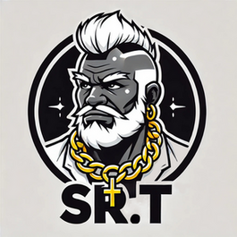

  
# Sr-T

# Sr_T - Subtitle Generation and Translation Tool

`sr_t` is a CLI tool for transcribing audio, and translating subtitles. It uses Whisper for transcription and supports translation models like Helsinki and NLLB.

## Features

- **Transcribe**: Generate subtitles from videos or audio files, in its original language.
- **Transcribe & Translate**: Generate subtitle from audio files in a specific target language.
- **Translate**: Translate existing subtitle files from a source language to a target language.

## Requirements

- Python 3.12
- Poetry for dependency management

## Installation

1. Clone the repository:
   ```bash
   git clone https://github.com/jitoledo/sr_t.git
   cd sr_t
2. Install dependencies with Poetry:

```bash
poetry install
```

3. Activate the virtual environment:

```bash
poetry shell
```

## Example Usage

Run the script using one of the supported modes:

### Transcribe Mode

```bash
./subtitle_cli.py --mode transcribe videos/v1.mp4 videos/v2.mp4
```

## Command-Line Arguments

| Argument                  | Required | Default      | Description                                                                                       |
|---------------------------|----------|--------------|---------------------------------------------------------------------------------------------------|
| `--mode`                 | Yes      | None         | Operation mode: `transcribe`, `transcribe-translate`, or `translate`.                            |
| `files`                  | Yes      | None         | List of input video or SRT files to process.                                                     |
| `--target-lang`          | No       | None         | Target language code (e.g., `en`, `es`, `spa_Latn`). Required for `translate` and `transcribe-translate` modes. |
| `--source-lang`          | No       | None         | Source language code for transcription or translation. Optional for `transcribe`.               |
| `--whisper-model`        | No       | `large-v3`   | Whisper model size. Used for `transcribe` and `transcribe-translate` modes.                      |
| `--translation-model`    | No       | `helsinki`   | Translation model type: `helsinki` or `nllb`. Target language code must match the model format.  |
| `--min-subtitle-duration`| No       | `2.0`        | Minimum duration (in seconds) for each subtitle entry. Defaults to 2 seconds.                    |

